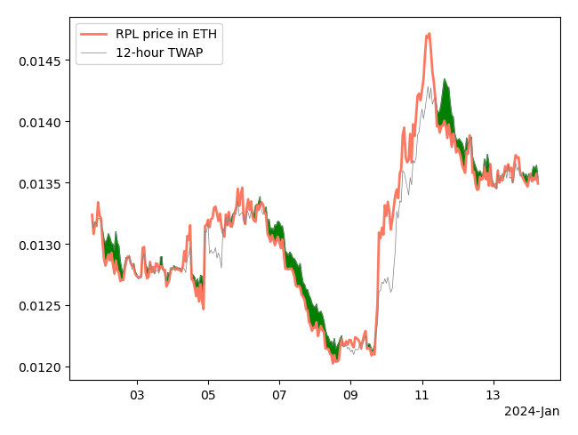

---
rpip:
title: RPL Burn
description: Allow RPL holders to burn RPL in exchange for protocol ETH
author: Valdorff (@Valdorff)
discussions-to: TBD
status: Draft
type: Protocol
category: Core
created: 2024-03-08
requires: rpip-uvc
---

## Abstract
This proposal establishes a contract that holds ETH from protocol revenue and allows for RPL to be burned in exchange for that protocol ETH. This provides direct utility to the RPL token.

## Specification
- Node Operators SHALL NOT be required to stake RPL in order to create minipools
- A share of revenue from borrowed ETH SHALL be directed to a smart contract (the burn contract) for the purpose of this burn (see [RPIP-uvc](draft-uvc.md))
- Any user MAY call a function in the burn contract to get ETH from the burn contract in exchange for RPL
- Any RPL exchanged this way SHALL burned by sending it to `0x000000000000000000000000000000000000dEaD`
- There SHALL be a function that calculates RPL's `circulatingSupply`, which is defined as `totalSupply` minus the amount burned
- The protocol SHOULD make efforts to base actions on `circulatingSupply` instead of `totalSupply`
  - This SHOULD be automated when tractable
  - This MAY be approximated manually
- The swap price SHALL be based on an on-chain oracle

## Implementation thoughts
There have been previous buy+burn mechanics susceptible to gaming. To that end, here's an example design that focuses on avoiding discontinuties by smoothly unlocking funds that are available for exchange.

The way this works is that:
- New distributions go into the Filling bucket
- After one `bucket_period` has passed, upon the next distribution:
  - Move Unlocking to Unlocked
  - Move Filling to Unlocking
  - Increment bucket_block by one `bucket_period` (repeat as needed until `bucket_block` > `current_block`)
  - Put the distribution into filling
- The contract will have `Unlocked + Unlocking + Filling` ETH in it
- The contract will allow burning RPL against `Unlocked + (Unlocking*UnlockingRatio)` ETH
  - `UnlockingRatio = 1 - ((bucket_block - current_block)/bucket_period)`

Let's visualize what being able to burn looks like in practice using real RPL price data and a simulated 12-hour TWAP.

We'd expect to burn all our available ETH at the beginning of a downturn (and thereby reduce its severity since that's not market sold). We'd also expect to continue burning against new distributions while price is on a downward slope. On an upward slope, there will be no expected burning until after the top is reached and we turn around for a bit.

### Security
- The design intentionally presents a small surface area. Any benefit an attacker can accrue is limited by the fact that no user has a privileged position and that value is streamed in smoothly without any discontinuities.
- The cost to attack the oracle depends on:
  - TWAP duration - 12 hours is currently in use by the oDAO and seems quite reasonable
  - Liquidity depth in the pool - it is strongly recommended that the DAO have some full-range protocol-owned liquidity to set a high-enough floor cost for attacks
- The benefit to an attacker of burning is proportional to the time that they have unique access to a trade; since all users have the same access, this boils down to quick changes in accessible value in the burn contract
  - 1 day is proposed as the `bucket_period`

## Copyright
Copyright and related rights waived via [CC0](https://creativecommons.org/publicdomain/zero/1.0/).
